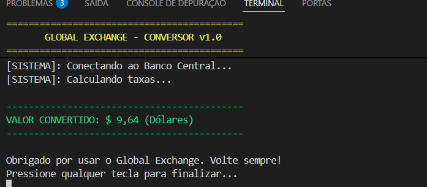

## O que esse projeto aplica?
Este projeto aplica três das Heurísticas de Nielsen para melhorar a Experiência do Usuário (UX):
1. Visibilidade do Status do Sistema: o programa mostra mensagens de processamento em tempo real, mantendo o usuário informado sobre o que está acontecendo.

2. Prevenção de Erros: a interação foi pensada para reduzir falhas, com mensagens claras e etapas bem definidas que evitam confusão.

3. Estética e Design Minimalista: a interface é simples e objetiva, exibindo apenas o essencial para facilitar a compreensão e tornar o uso mais agradável.
Em resumo, o sistema transmite confiança, evita problemas e mantém a apresentação limpa, aplicando na prática os princípios de usabilidade.

## 📸 Evidência de Execução

